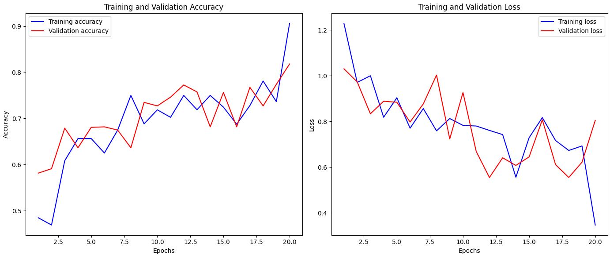

# Flower image prediction

Dataset: https://www.kaggle.com/datasets/kurito/flower-photos

## Hypotheses

1. Does one flower color outstand others in the evaluation of the training?

2. Does one more layer in the model change the outcome of the training?

3. Does a over-/undersampling of the image dataset make a better result?

4. Will the model learn better with the mean image shape (365x271) or with 224x224?

## Model evaluation

- first try with this model: `

def create_model():
    input_shape = (365, 271, 3)  
    num_classes = 5  
    model = Sequential()

    model.add(Conv2D(32, (3, 3), activation='relu', input_shape=input_shape))
    model.add(MaxPooling2D(pool_size=(2, 2)))

    model.add(Conv2D(64, (3, 3), activation='relu'))
    model.add(MaxPooling2D(pool_size=(2, 2)))

    model.add(Conv2D(128, (3, 3), activation='relu'))
    model.add(MaxPooling2D(pool_size=(2, 2)))

    model.add(Flatten())
    model.add(Dense(128, activation='relu'))
    model.add(Dropout(0.5))  # Dropout för att förhindra överträning
    model.add(Dense(num_classes, activation='softmax'))  # Softmax för klassificering

    model.compile(optimizer='adam', 
                  loss='categorical_crossentropy', 
                  metrics=['accuracy'])

    model.summary()
    
    return model

