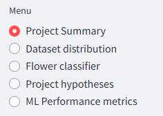

# Manual tests on streamlit dashboard

The menu

 

| Feature | Expected Outcome | Testing Performed | Result | Pass/Fail |
| --- | --- | --- | --- | --- |
| Navigate to Dataset distribution | When clicking on "Dataset distribution", the page with dataset distribution will show | Clicked on "Dataset distribution" | The page with dataset info was shown | Pass |
| Navigate to Flower classifier | When clicking on "Flower classifier", the page where users can upload image for prediction will show | Clicked on "Flower classifier" | The page where users can upload images was shown | Pass |
| Navigate to Project hypotheses | When clicking on "Project hypotheses", the page with the projects hypotheses will show  | Clicked on "Project hypotheses" | The page where all information about the projects hypotheses was shown | Pass |
| Navigate to ML Performance metrics | When clicking on "ML Performance metrics", the page with the models performance will show | Clicked on "ML Performance metrics" | The page with the models performance metrics was shown | Pass |
| Navigate to Project Summary | When clicking on "Project Summary", the page with the summary will show | Clicked on "Project Summary" | The page with a summary of the project was shown | Pass |

## Issue with the model

Predicting roses and tulips

 
As we can see in this heatmap, the colors in the categories of tulips and roses are nearest eachother. This makes the prediction between these two categories the hardest for this model. And if we look at the classification report and the confusion matrix, this also shows that the model having problems with predicting these two categories.

 
 

**Here are some examples when the model predicts with barely majority and with the wrong category:**  
 
 
These examples barely have majority on the right class.  But here are a prediction that shows roses instead of tulips that are on the image: 
  

