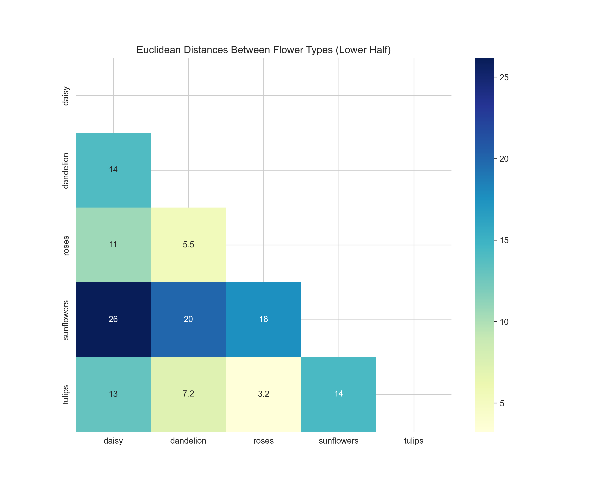
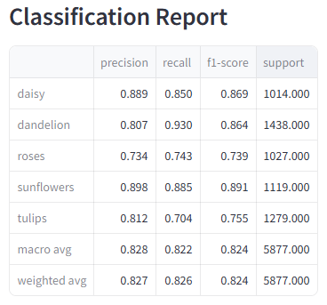
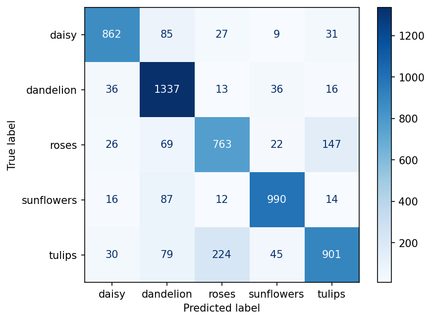
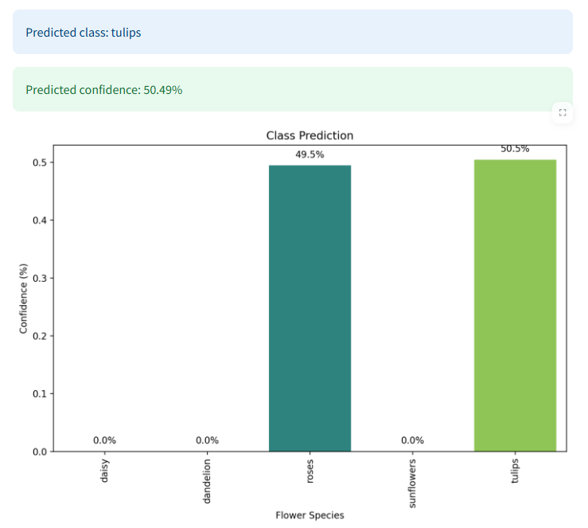
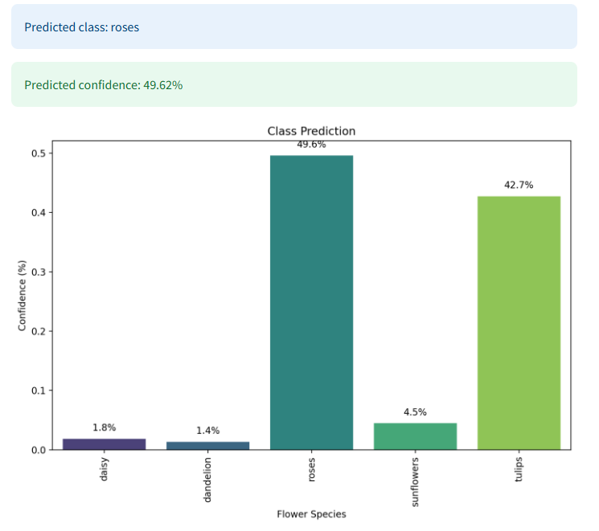
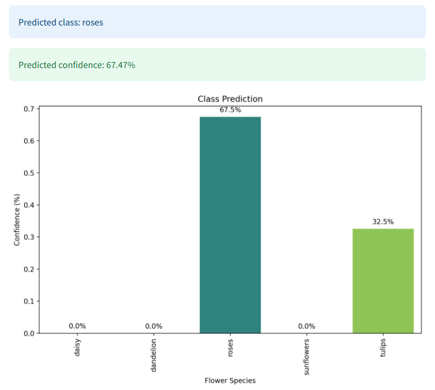

## Issue with the model

 
As we can see in this heatmap, the colors in the categories of tulips and roses are nearest eachother. This makes the prediction between these two categories the hardest for this model. And if we look at the classification report and the confusion matrix, this also shows that the model having problems with predicting these two categories.

 
 

**Here are some examples when the model predicts with barely majority and with the wrong category:**  
 
 
These examples barely have majority on the right class.  But here are a prediction that shows roses instead of tulips that are on the image: 
  