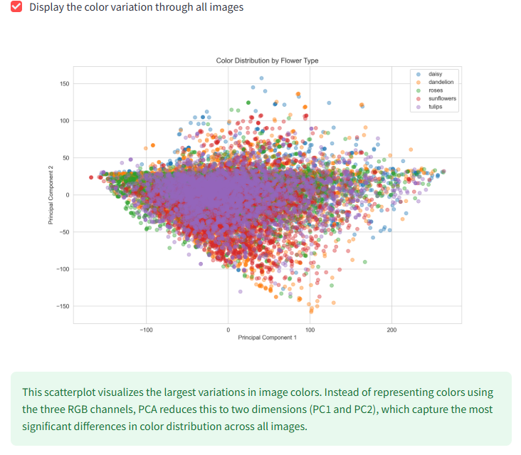
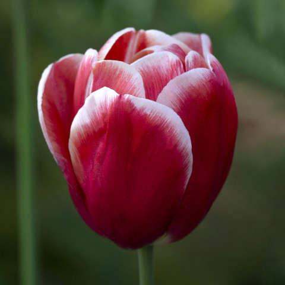

# Manual tests on streamlit dashboard

The menu

 

| Feature | Expected Outcome | Testing Performed | Result | Pass/Fail |
| --- | --- | --- | --- | --- |
| Navigate to Dataset distribution | When clicking on "Dataset distribution", the page with dataset distribution will show | Clicked on "Dataset distribution" | The page with dataset info was shown | Pass |
| Navigate to Flower classifier | When clicking on "Flower classifier", the page where users can upload image for prediction will show | Clicked on "Flower classifier" | The page where users can upload images was shown | Pass |
| Navigate to Project hypotheses | When clicking on "Project hypotheses", the page with the projects hypotheses will show  | Clicked on "Project hypotheses" | The page where all information about the projects hypotheses was shown | Pass |
| Navigate to ML Performance metrics | When clicking on "ML Performance metrics", the page with the models performance will show | Clicked on "ML Performance metrics" | The page with the models performance metrics was shown | Pass |
| Navigate to Project Summary | When clicking on "Project Summary", the page with the summary will show | Clicked on "Project Summary" | The page with a summary of the project was shown | Pass |

Dataset distribution page

 

| Feature | Expected Outcome | Testing Performed | Result | Pass/Fail |
| --- | --- | --- | --- | --- |
| Display image distribution | When clicking on "Display image distribution through all flower species", the image of the barplot of the distribution will show and also the amount of the images in every category. | Clicked on "Display image distribution through all flower species" | The barplot and amount of the distribution was shown | Pass |
| Display color variation | When clicking on "Display the color variation through all images", the image and info about the color variation will show | Clicked on "Display the color variation through all images" | The scatterplot,heatmap and info about the color variations was shown | Pass |
| Display image montages | When clicking on "Display montage of random images of all flowers", the image montage showing random images of all categories will be shown | Clicked on "Display montage of random images of all flowers" | The image montage where the user can choose category was shown | Pass |

<strong>Images from the test</strong>

 

 

 
 
 

Image montage

 

| Feature | Expected Outcome | Testing Performed | Result | Pass/Fail |
| --- | --- | --- | --- | --- |
| Displaying montage of Tulips | When selecting "Tulips", a montage with 6 random images of tulips will show | Selected "Tulips" | 6 random images of tulips was shown | Pass |
| Displaying montage of Sunflowers | When selecting "Sunflowers", a montage with 6 random images of sunflowers will show | Selected "Sunflowers" | 6 random images of sunflowers was shown | Pass |
| Displaying montage of Daisies | When selecting "Daisies", a montage with 6 random images of Daisies will show | Selected "Daisies" | 6 random images of daisies was shown | Pass |
| Displaying montage of Roses | When selecting "Roses", a montage with 6 random images of roses will show | Selected "Roses" | 6 random images of roses was shown | Pass |
| Displaying montage of Dandelions | When selecting "Dandelions", a montage with 6 random images of dandelions will show | Selected "Dandelions" | 6 random images of dandelions was shown | Pass |

<strong>Images from the test</strong>

 

 
 
 
 
 

Flower classifier

 

| Feature | Expected Outcome | Testing Performed | Result | Pass/Fail |
| --- | --- | --- | --- | --- |
| Uploading file with wrong extension | When trying to upload a file with the wrong extension it will raise an error that the file are not allowed | Tried to upload a .pdf-file | An error was raised that the file wasn´t allowed | Pass |
| Uploading an image with flower | When uploading an image of a flower the model will predict and show percentage through all classes highlighting the predicted class with the percentage | Uploaded an image of daisies | My uploaded image was shown with the prediction and all percentage through the classes | Pass |

<strong>Images from the test</strong>

 

 

 
 

Project hypotheses and ML Performance metrics

 

| Feature | Expected Outcome | Testing Performed | Result | Pass/Fail |
| --- | --- | --- | --- | --- |
| Project hypotheses page showing correct info | When navigated to the Project hypotheses page the info about the hypotheses and validations will be shown | Navigated to hypotheses page | On the project hypotheses page the correct information was shown | Pass |
| ML Performance metrics page showing correct info | When navigated to the ML Performance metrics page, all the images and info will be visual and correct | Navigated to the ML Performance metrics page | All the correct images and information was shown on the page | Pass |

## Issue with the model

Predicting roses and tulips

 
As we can see in this heatmap, the colors in the categories of tulips and roses are nearest eachother. This makes the prediction between these two categories the hardest for this model. And if we look at the classification report and the confusion matrix, this also shows that the model having problems with predicting these two categories.

 
 

**Here are some examples when the model predicts with barely majority and with the wrong category:**  
 
 
These examples barely have majority on the right class.  But here are a prediction that shows roses instead of tulips that are on the image: 
  

